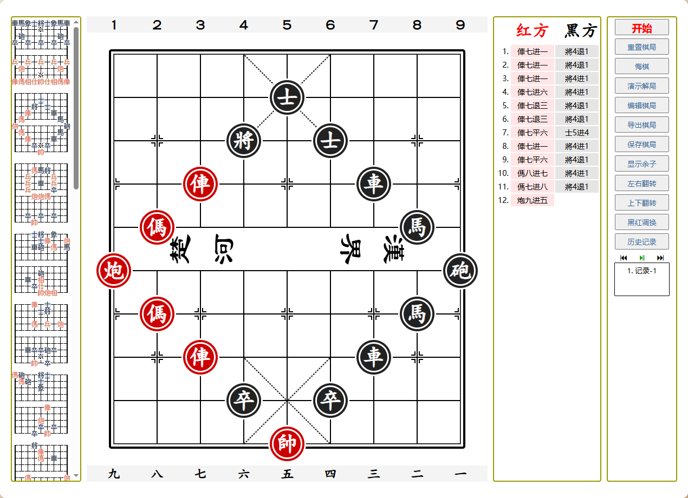

# 中国象棋
| 学习编程练手
## 基本功能
1. 残局列表
2. 编辑棋局
3. 导出棋局：字符格式、图片格式
4. 悔棋
5. 重置棋局
6. 对弈记录
7. 记录回放
8. 棋局调整：上下左右対调，黑红对调

## 1. 版本2024 使用纯css实现界面，无图片
[访问](2024/1103.html)

## 2. 版本2025 背景图片，棋子图片
[访问](2025/index.html)

## 效果预览



## FEN转换
```javascript
// 转换FEN格式到本地格式
function map_from_fen(fen){
	fen=fen.split(' ');
	let str=fen[0].replaceAll('/','')
	let source='cmxsjzpCMXSJZP'.split('').reverse();
	let target='rnbakcpRNBAKCP'.split('').reverse();
	for(let i=0;i<target.length;i++){
		str=str.replaceAll(target[i],source[i])
	}
	let flag=fen[1]
// 如果黑棋先走，则转换黑红棋子。 默认红旗先手
	if(flag=='b'){
		let arr=str.split('')
		for(let i=0;i<arr.length;i++){
			if(/[A-Z]/.test(arr[i])){
				arr[i]=arr[i].toLowerCase();
			}else if(/[a-z]/.test(arr[i])){
				arr[i]=arr[i].toUpperCase();
			}
		}
		str=arr.join('')
	}
	return str
}
```

```javascript
//转换本地格式到FEN格式
function map_to_fen(str){
	let source='cmxsjzpCMXSJZP'
	let target='rnbakcpRNBAKCP'
	for(let i=0;i<source.length;i++){
		str=str.replaceAll(source[i],target[i])
	}
	let n=0;
	let line=[0];
	let res=[]
	for(let i=0;i<str.length;i++){
		n+=isNaN(str[i])?1:str[i]*1
		if(n==9){
			line.push(i+1);
			n=0
		}
	}
	for(let i=0;i<line.length-1;i++){
		res.push(str.slice(line[i],line[i+1]))
	}
	return(res.join('/')+' w')
}
```
